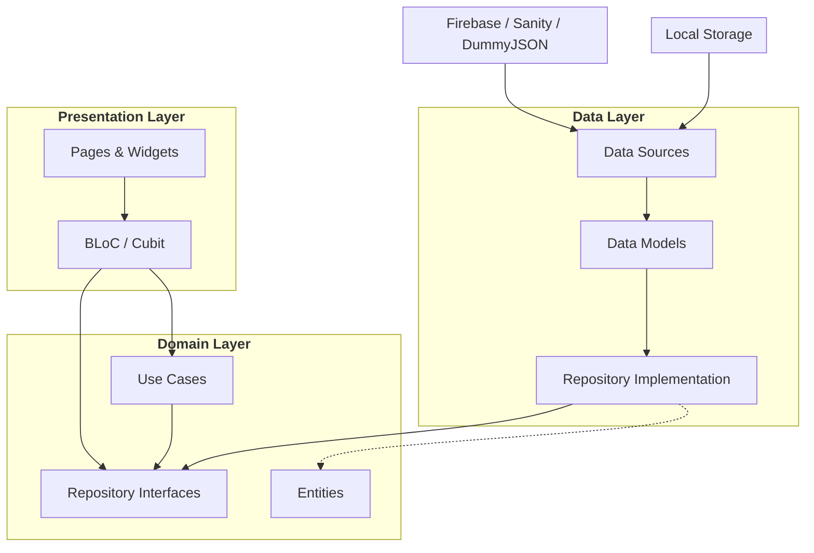

# Flutly Store


Flutly is a **demo e-commerce mobile application** built with Flutter to showcase clean architecture, feature-based organization, and production-ready patterns.

> ⚠️ This app is for **demonstration purposes only**. No real payments, orders, or transactions are processed.


## 📑 Table of Contents

- [Overview](#-overview)
- [Screenshots](#-screenshots)
- [Key Features](#-key-features)
- [Architecture](#-architecture)
- [Technical Decisions](#-technical-decisions)
- [Getting Started](#-getting-started)
- [Testing](#-running-the-tests)
- [Author](#-author)

## ✨ Overview

Flutly simulates a complete shopping experience, including authentication, product browsing, cart management, and checkout.

The project is structured to reflect real-world mobile applications, prioritizing:

- Feature-based organization
- Clear separation of concerns
- Scalable navigation and state management
- Maintainable and testable architecture

## 📸 Screenshots

<table style="border-style: none; border-color: transparent;">
  <tr>
    <td></td>
    <td></td>
    <td></td>
    <td></td>
    <td></td>
  </tr>
</table>

## 📱 Key Features

- **Authentication:** Email/password and social sign-in.
- **Dynamic Content:** Home integrated with Sanity CMS.
- **Product Catalog:** Search, filtering, and product details.
- **Cart & Checkout:** Local state management with mocked checkout flow.
- **Feedback Loop:** Built-in bug reporting flow.

## 🧪 Try the App (Closed Test)

You can install the Flutly app directly on your device via the closed test builds.

👉 [Flutly – Closed Test Page](https://slow-bath-005.notion.site/Flutly-Store-Closed-Test-2e762a6865a680a79b23d1d05e153c4d?pvs=74)

## 🧱 Tech Stack

- **Flutter & Dart**
- **State management:** `flutter_bloc`
- **Navigation:** `go_router`
- **Dependency injection:** `get_it`
- **Networking:** `dio`
- **Local storage:** `shared_preferences`, `flutter_secure_storage`
- **Forms:** `reactive_forms`
- **Localization:** `easy_localization`
- **Backend Services:** Firebase (Auth, Firestore, Analytics) & Sanity CMS.

## 🏗 Architecture

Flutly follows a **feature-first Clean Architecture** approach.



## 🗂️ Folder Structure

Each feature (e.g., auth, catalog, checkout) is self-contained:

```
lib/
├── app/
│   ├── core/           # Routing, DI, HttpClient, Storage
│   ├── shared/         # Common Widgets, Theme, Extensions
│   └── features/
│       ├── auth/       # Feature: Authentication
│       ├── catalog/    # Feature: Product Browsing
│       ├── cart/       # Feature: Shopping Cart
│       └── ...
├── main.dart
└── firebase_options.dart
```

## 💡 Technical Decisions

### Why BLoC?

I chose flutter_bloc for its strict separation of presentation and business logic. It provides a predictable state stream, making it easier to trace bugs and write unit tests for every user interaction.

### The "Demo Mode"

To make this portfolio project easy to run for recruiters and developers, I implemented a Demo Mode.

- Challenge: The app needed to function fully without requiring valid Firebase credentials.
- Solution: Based on environment variables, the Dependency Injection (GetIt) swaps the real Firebase implementations for Mock implementations at runtime. This ensures the UI code remains completely agnostic of the data source.

## 🚀 Getting Started

### Prerequisites
- Flutter SDK (`sdk: ^3.9.2`)
- Android Studio or Xcode
- CocoaPods (for iOS)

### Configuration

#### Environment variables

Environment values are provided via `--dart-define`. The project includes an env.example.json file preconfigured to run without backend friction.

#### ⚡ Demo Mode (Recommended)

By default, Flutly runs in demo mode. No Firebase project or credentials are needed. Authentication is simulated, and data is handled locally.

1. Create the env file:

```bash
cp env.example.json env.prod.json
```

2. Run the app:

```bash
flutter run --dart-define-from-file=env.prod.json
```

#### 🔥 Firebase Mode

To enable real backend integration:

1. Open `env.prod.json` and set:

```bash
"USE_FIREBASE": true
```

2. Create a Firebase project (Auth + Firestore enabled).

3. Add configuration files (google-services.json / GoogleService-Info.plist).

4. Reconfigure via FlutterFire:

```bash
flutterfire configure
```

5. Run the app:

```bash
flutter run --dart-define-from-file=env.prod.json
```

#### Installation

```bash
# Install dependencies
flutter pub get

# iOS setup
cd ios && pod install
```

## 🧪 Running the Tests

The project prioritizes test coverage for Domain logic, Use Cases, and Repositories.

### Unit and Widget Tests

```bash
flutter test
```

### Test Coverage

To generate coverage data and HTML report:

```bash
flutter test --coverage
genhtml coverage/lcov.info -o coverage/html
```

> Note: `genhtml` is part of `lcov`.
> - macOS: `brew install lcov`
> - Ubuntu/Debian: `sudo apt-get install lcov`


## 🎨 Assets & Localization

- Assets: `assets/icons`, `assets/images`
- Localization: Handled via `easy_localization` (Current locale: `en`).

## 👨‍💻 Author

Gabriel Peres Bernes 
Mobile Software Engineer — Flutter Specialist

LinkedIn: [https://www.linkedin.com/in/gabriel-peres-bernes/](https://www.linkedin.com/in/gabriel-peres-bernes/)

Email: bernes.dev@gmail.com

## 📄 License & Disclaimer

This project is intended for educational and demonstration purposes only and does not represent a real commercial product.
